# Entrega 1 — Análise Exploratória de Dados

**Vazios assistenciais no SUS: onde falta infraestrutura e onde a atenção
primária não segura o paciente**

CIN0144 — Aprendizado de Máquina e Ciência de Dados · CIn/UFPE · 2026.1

> Este relatório acompanha o notebook [`notebooks/01-eda.ipynb`](../notebooks/01-eda.ipynb),
> onde está todo o código executável e as figuras. As figuras também estão em
> [`reports/figuras/`](../reports/figuras/).

---

## 1. Caracterização do problema e da base

### 1.1 Justificativa e objetivo

Perguntar "este município tem estabelecimento de saúde?" não é um problema de
aprendizado: praticamente 100% dos municípios brasileiros têm. É preciso subir
na escada de complexidade até achar o serviço cuja presença ainda varia — e,
depois, perguntar se o serviço que existe **funciona**. Daí as duas perguntas:

| | Pergunta | Tarefa | Alvo |
|---|---|---|---|
| **Etapa 1** | O município tem leito de UTI? | Classificação binária | `tem_uti` |
| **Etapa 2** | A atenção primária está segurando o paciente? | Regressão | `taxa_icsap` |

**Aplicação prática.** O produto não é a métrica do modelo, e sim a lista dos
municípios em que ele **erra** na Etapa 1: os que, pelo porte, população e
economia, "deveriam" ter UTI e não têm. Esse é o insumo usado para priorizar
alocação de recurso, e tem nome na literatura de saúde pública — **vazio
assistencial**.

**ICSAP.** Internações por Condições Sensíveis à Atenção Primária são
internações evitáveis: pneumonia bacteriana, diabetes descompensado,
hipertensão, infecção urinária. Se a atenção básica funciona, elas não
acontecem. É um indicador de **função**, não de **prédio**, e não vem pronto em
base nenhuma — é derivado do CID-10 de cada internação, seguindo a
**Portaria SAS/MS nº 221/2008**.

### 1.2 Fonte, coleta e licença

Todas as fontes são públicas, governamentais e abertas, acessadas em
**10/09/2026**. Nenhuma exige cadastro, chave de API ou aceite de termos.

| Fonte | Órgão | Fornece |
|---|---|---|
| API de Localidades | IBGE | Malha municipal, UF, região |
| SIDRA 5938 / 1301 | IBGE | PIB e VAB setorial / área territorial |
| Estimativas TCU | IBGE via DATASUS | População por município e ano |
| CNES (3 tabulações) | Min. Saúde | Leitos de UTI, leitos de internação, estabelecimentos |
| SIH/SUS por residência | Min. Saúde | Internações SUS e diagnóstico |
| SIM / SINASC | Min. Saúde | Óbitos infantis / nascidos vivos e pré-natal |

**Licença:** dados abertos governamentais, uso livre com citação da fonte
(Lei nº 12.527/2011). Ficha completa em [`01-fontes-de-dados.md`](01-fontes-de-dados.md).

**Coleta.** Scripts em `src/` consultam as APIs do IBGE e o TabNet do DATASUS e
congelam a resposta bruta em `data/raw/`. A base é reproduzível sem rede.

Duas decisões de coleta mudam materialmente o resultado:

1. **Município de residência, nunca de internação.** Quem mora em município
   pequeno se interna na cidade média vizinha. Atribuindo ao município do
   hospital, o pequeno pareceria saudável e o médio, doente — viés enorme e
   correlacionado com o que queremos explicar.
2. **Ausência no CNES é zero, não valor faltante.** O TabNet só devolve linha
   para município que tem o recurso. Não aparecer significa "não existe leito de
   UTI aqui". Imputar a média aí seria inventar UTI onde não há.

### 1.3 Dimensões e tipos de variáveis

**55.700 instâncias × 53 atributos**, unidade município × ano, 5.570 municípios
× 10 anos (2014–2023).

| Tipo | Qtd. | Exemplos |
|---|---|---|
| Identificador (fora do modelo) | 3 | `cod_ibge7`, `municipio` |
| Categórico nominal | 4 | `uf`, `regiao`, `mesorregiao` |
| Categórico ordinal | 1 | `porte_populacional` |
| Binário | 4 | `capital`, `periodo_pandemia`, `tem_uti`, `vazio_assistencial` |
| Temporal | 1 | `ano` |
| Quantitativo discreto (contagem) | 18 | `populacao`, `leitos_uti`, `internacoes_total` |
| Quantitativo contínuo | 22 | `pib_per_capita`, `taxa_icsap`, `dist_uti_km` |

Dos 53, **36 são candidatos a preditor**, 9 são proibidos por vazamento (§3.6),
3 são identificadores e 4 são alvos ou componentes de alvo. Dicionário completo
em [`05-dicionario-de-dados.md`](05-dicionario-de-dados.md).

### 1.4 Tipo de tarefa e variáveis-alvo

- **`tem_uti`** (classificação binária): 1 se há ao menos um leito de UTI no
  CNES em dezembro do ano. Cobre UTI adulto, pediátrica, neonatal, de queimados
  e coronariana; exclui unidade intermediária, isolamento e suporte
  ventilatório COVID.
- **`taxa_icsap`** (regressão): internações sensíveis ÷ internações totais, por
  residência, somando as 12 competências do ano. **Proporção e não contagem**,
  para separar tamanho de intensidade.

⚠️ `taxa_icsap` é uma **aproximação declarada** da Lista Brasileira. O TabNet
não expõe CID de 3/4 caracteres no recorte Brasil × município — só a *Lista de
Morbidade CID-10* (333 grupos). Dos 19 grupos da portaria, **9 batem código a
código**, 6 superestimam e 4 subestimam. O viés é predominantemente para cima e
aproximadamente sistemático, o que preserva o **ordenamento** entre municípios —
que é o que a regressão comparativa precisa. Detalhamento grupo a grupo em
[`03-icsap-operacionalizacao.md`](03-icsap-operacionalizacao.md).

---

## 2. Resultados da análise exploratória

### 2.1 Assimetria extrema nas variáveis de tamanho

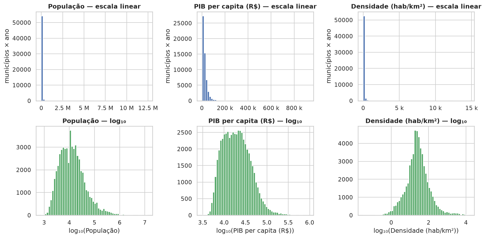

`populacao` tem assimetria **37,3** e `leitos_uti`, **36,8**. A mediana da
população é 11.499 e o máximo passa de 12,4 milhões — três ordens de grandeza.
Em escala linear os histogramas são ilegíveis: tudo se amontoa numa barra colada
no zero, porque a escala é ditada por São Paulo. Em log₁₀ aparece a estrutura
real, aproximadamente log-normal.

**Interpretação.** O fenômeno é multiplicativo: uma diferença de 5 mil
habitantes significa coisas diferentes num município de 8 mil e num de 800 mil.
As **taxas**, ao contrário, se comportam bem — `taxa_icsap` tem assimetria 1,07
e `pct_prenatal_7mais`, −1,04. Foi exatamente para isso que normalizamos por
exposição. Um detalhe: 25% dos municípios-ano **não têm um leito hospitalar
sequer**.

### 2.2 Os dois alvos

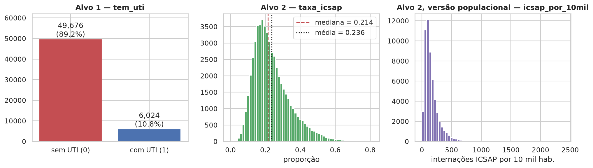

`tem_uti` tem **10,8% de positivos**, razão 8,2:1 — desbalanceamento genuíno,
vindo do fenômeno. `taxa_icsap` é unimodal, média 0,236 e mediana 0,214: alvo
contínuo bem-comportado, resultado direto de ter escolhido proporção.

> **A acurácia não pode ser a métrica principal da Etapa 1.** Um modelo que
> responde "não tem UTI" para tudo acerta **89,2%** sem aprender nada.

### 2.3 O achado central: o alvo 1 é quase determinado pelo porte

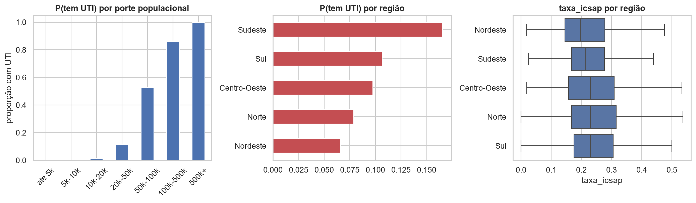

| Porte | P(tem UTI) |
|---|---|
| até 5 mil | 0,000 |
| 5–10 mil | 0,001 |
| 10–20 mil | 0,012 |
| 20–50 mil | 0,113 |
| 50–100 mil | 0,529 |
| 100–500 mil | 0,859 |
| 500 mil + | 1,000 |

**Interpretação, em duas direções opostas.** (i) Espere um modelo muito bom —
uma logística só com população provavelmente já entrega AUC alta — e desconfie
disso. (ii) O valor está na **faixa de transição**, entre 20 mil e 100 mil
habitantes, onde o modelo tem incerteza real. É ali que o falso positivo carrega
informação, e essa lista é o produto do projeto.

O Sudeste tem 16,6% de municípios com UTI contra 6,6% do Nordeste, mas boa parte
disso é composição de porte, não região *per se*.

`taxa_icsap` por região é surpreendentemente plana (0,227 no Nordeste a 0,249 no
Sul). A leitura ingênua seria "a APS é igual em todo lugar"; a correta é que a
taxa é uma **proporção** — onde o acesso hospitalar é restrito, numerador e
denominador encolhem juntos.

### 2.4 Série temporal: três movimentos reais

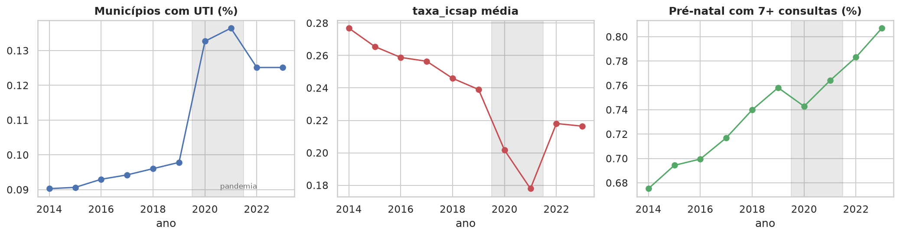

| Ano | % com UTI | `taxa_icsap` | Leitos de UTI (Brasil) | % pré-natal 7+ |
|---|---|---|---|---|
| 2014 | 9,0% | 0,277 | 40.479 | 67,5% |
| 2019 | 9,8% | 0,239 | 46.062 | 75,8% |
| 2021 | 13,6% | 0,178 | 76.110 | 76,4% |
| 2023 | 12,5% | 0,216 | 62.359 | 80,7% |

1. **Salto de UTI em 2020–2021**: leitos COVID. O total nacional sai de 46 mil
   para 76 mil e recua para 62 mil. Não é erro de dado — é política pública
   aparecendo na base.
2. **`taxa_icsap` cai de forma sustentada**, despenca na pandemia e volta
   parcialmente.
3. **Pré-natal adequado sobe 13 pontos** ao longo de todo o período.

> ⚠️ **A armadilha interpretativa do projeto.** A queda de ICSAP em 2020–2021
> **não** significa que a atenção primária melhorou — significa que as pessoas
> deixaram de ir ao hospital. É o tipo de erro que nenhuma métrica de regressão
> detecta sozinha.

### 2.5 Estrutura do painel: o alvo é quase constante no município

- Nunca teve UTI em 10 anos: **4.753 municípios (85,3%)**
- Sempre teve: **486 (8,7%)**
- Mudou de status: **331 (5,9%)**

**Interpretação.** O alvo é quase inteiramente uma característica *do município*,
não do município-ano. Se o mesmo município cai no treino e no teste, o modelo
não precisa aprender nada — basta reconhecê-lo e repetir a resposta. Por isso a
validação cruzada da Etapa 1 **tem** de ser agrupada por município.

### 2.6 Relações entre variáveis

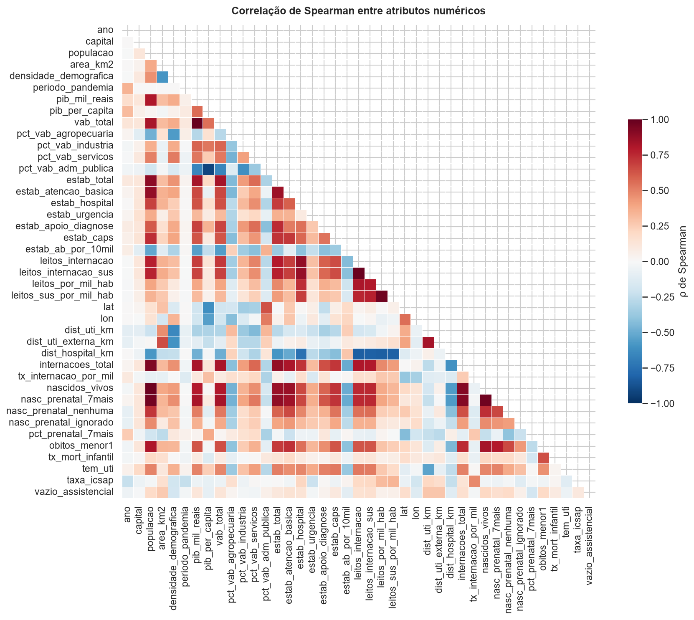
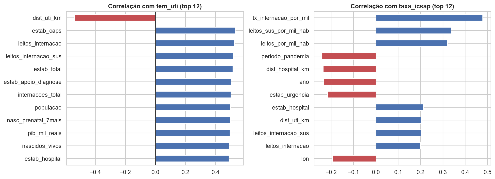

Usamos **Spearman** e não Pearson: com assimetria 37, um único outlier domina o
Pearson. Spearman opera sobre postos e é imune a isso.

**`tem_uti`.** Tudo que correlaciona forte é **tamanho**: leitos de internação
(0,53), estabelecimentos (0,52), internações (0,50), população (0,50), PIB
(0,50). Nenhum atributo captura necessidade ou isolamento — e essa é a lacuna
mais séria da base (§4.3).

**`taxa_icsap`.** Correlações bem mais fracas, e as fortes são desconfortáveis:

- `tx_internacao_por_mil` (0,48);
- `leitos_sus_por_mil_hab` (0,34) — **mais oferta hospitalar, mais internação
  evitável**: demanda induzida pela oferta;
- `ano` e `periodo_pandemia` (−0,23);
- `densidade_demografica` (−0,19), `pct_vab_agropecuaria` (+0,16) — gradiente
  rural/urbano.

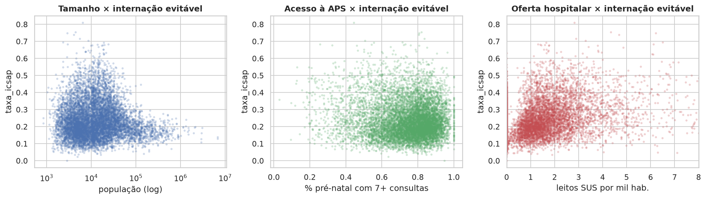

A dispersão *pré-natal × ICSAP* mostra relação negativa, fraca e ruidosa: faz
sentido clinicamente, mas nenhuma reta explica. **A Etapa 2 será genuinamente
difícil**, e é por isso que é o diferencial do projeto.

A dispersão *oferta hospitalar × ICSAP* é positiva. Além da demanda induzida, há
uma hipótese alternativa mais incômoda: onde não há hospital, a internação
evitável não aparece na base porque **não houve registro** — e não porque a APS
resolveu. É o *"quem não foi medido não existe"*, e precisa estar nas limitações.

### 2.7 Isolamento geográfico — o achado mais forte

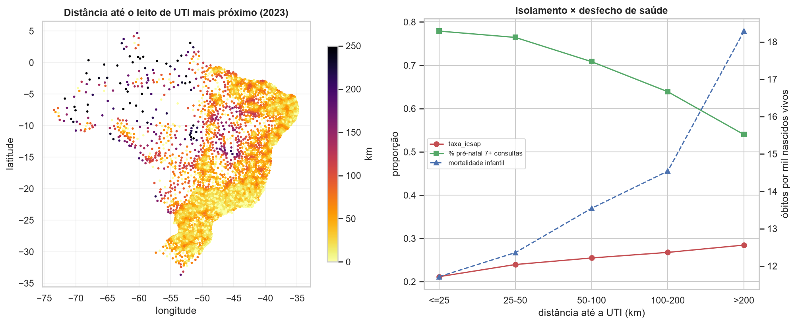

Todos os atributos anteriores descrevem o município olhando **para dentro** dele.
`dist_uti_km` olha para fora: a que distância está o leito de UTI mais próximo,
calculada por centroide de área (malha do IBGE) e distância haversine,
**recalculada ano a ano** porque leitos abrem e fecham.

**Por que era indispensável.** Sem esse atributo, um município sem UTI a 15 km de
uma capital e um a 500 km de tudo são **idênticos na base** — e são situações
opostas: a primeira é especialização metropolitana normal, a segunda é vazio
assistencial. O erro do modelo seria ininterpretável.

**ρ(distância, população) = 0,078** entre os municípios sem UTI. É a primeira
variável do projeto que não é tamanho disfarçado — todas as outras correlacionam
~0,50 com o alvo justamente por medirem escala. Ressalva honesta: a distância
não é ortogonal à *densidade* (ρ = −0,65); município isolado costuma ser vazio.

Mediana de 39,6 km, p90 de 109 km, **máximo de 865 km**.

**O gradiente dose-resposta.** Conforme o isolamento cresce, três indicadores
medidos por sistemas diferentes pioram juntos:

| Distância até UTI | `taxa_icsap` | Mortalidade infantil | Pré-natal 7+ |
|---|---|---|---|
| ≤ 25 km | 0,212 | 11,7 | 77,9% |
| 25–50 km | 0,240 | 12,4 | 76,4% |
| 50–100 km | 0,255 | 13,5 | 70,8% |
| 100–200 km | 0,268 | 14,5 | 63,9% |
| > 200 km | **0,285** | **18,3** | **54,0%** |

Internação evitável sobe, mortalidade infantil sobe 56%, cobertura de pré-natal
cai 24 pontos. SIH, SIM e SINASC apontando na mesma direção.

⚠️ **Associação, não causalidade.** Isolamento vem junto com pobreza, baixa
densidade e menor cobertura de atenção básica. A distância pode ser o marcador
visível de tudo isso — separar os efeitos é modelagem, não EDA.

### 2.8 Vazio assistencial: o produto do projeto

`vazio_assistencial = 1` quando o município **não tem UTI**, tem **≥ 20 mil
habitantes** e está a **≥ 100 km** do leito mais próximo — a interseção entre
"população suficiente para justificar o serviço" e "longe demais para alcançá-lo".
Os dois cortes são explícitos no código justamente para poderem ser questionados.

- **1.730 municípios-ano (3,1%)** se enquadram.
- **Norte: 19,6% · Sul: 0,08%** — razão de **250 para 1**. Nenhum outro atributo
  separa as regiões dessa forma.
- **A pandemia encurtou distâncias e o efeito ficou:** a distância mediana cai de
  41,3 km (2019) para 35,4 km (2021) e não retorna (36,5 km em 2023); os vazios
  caem de 192 para 106. Os leitos COVID abriram UTIs onde não havia, e parte
  permaneceu. É um argumento **contra** excluir 2020–2021 da análise.
- **A lista concreta:** Itacoatiara (AM), 103.598 habitantes, **175 km**;
  Oriximiná (PA), 68.294 habitantes, **329 km**. Municípios maiores que centenas
  que *têm* UTI.

Na Etapa 1 essa lista vira o conjunto dos falsos positivos do modelo. Aqui, já
aparece como recorte descritivo.

---

## 3. Diagnóstico dos dados

### 3.1 Valores ausentes: todos estruturados

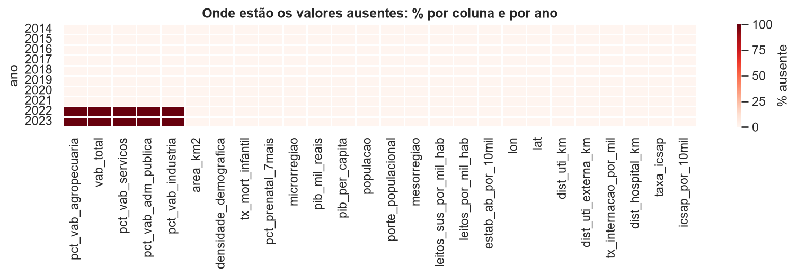

| Coluna | % ausente | Causa identificada |
|---|---|---|
| `vab_*`, `vab_total` | 20,01% | O IBGE ainda **não publicou** a abertura setorial do PIB para 2022 e 2023 |
| `area_km2` | 0,11% (6 municípios) | Municípios instalados **depois do Censo 2010**, fonte da área |
| `populacao` | 0,02% (1 município) | Boa Esperança do Norte (MT) não entra na série de estimativas do TCU |
| 10 taxas derivadas | 0,02% | Propagação do denominador ausente |

Os 6 municípios sem área: Mojuí dos Campos (PA), Pescaria Brava (SC), Balneário
Rincão (SC), Pinto Bandeira (RS), Paraíso das Águas (MS) e Boa Esperança do
Norte (MT).

**Interpretação.** Nenhum buraco é aleatório, e essa é a informação que importa:
imputação pela média pressupõe que o valor faltante veio da mesma população que
os observados. Nos `vab_*` isso é falso por construção — a ausência é o IBGE não
ter publicado, e imputar seria inventar estatística oficial.

### 3.2 Outliers: três naturezas, três tratamentos

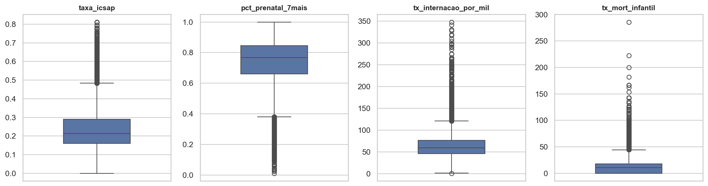

1. **Extremos legítimos de escala.** `populacao` = 12,4 milhões (São Paulo),
   `leitos_uti` = 7.427. A regra de Tukey marca milhares de linhas porque
   pressupõe simetria, e aqui a distribuição é log-normal. **Remover apagaria as
   capitais.** Tratamento: log, não remoção.
2. **Extremos por denominador pequeno.** `tx_mort_infantil` chega a 285 por mil —
   só possível com um punhado de nascimentos. É ruído, não epidemia.
3. **Valores fora de domínio: nenhum.** `taxa_icsap` ∈ [0; 0,812],
   `pct_prenatal_7mais` ∈ [0,011; 1,0], nenhuma contagem negativa. Os poucos
   valores negativos em `vab_industria` e `vab_adm_publica` são legítimos: valor
   adicionado bruto pode ser negativo.

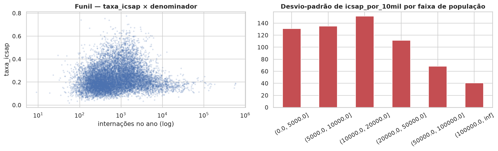

**Instabilidade de pequenas áreas — e aqui a base surpreende.** Na versão
**proporcional** o funil é fraco: desvio-padrão 0,092 na faixa de até 50
internações contra 0,107 na faixa de 300–1.000. Motivo: a mediana de internações
por município-ano é **668**, e só 2% das linhas ficam abaixo de 100 — o SIH
acumula 12 competências e todo município tem residentes internados em algum
lugar.

Na versão **populacional** (`icsap_por_10mil`) o funil aparece claramente:
desvio-padrão **131** para municípios de até 5 mil habitantes contra **41** para
os acima de 100 mil.

**A escolha de `taxa_icsap` como alvo principal é validada empiricamente**, não
só por argumento.

### 3.3 Desbalanceamento

Razão 8,2:1, **não estacionário**: de 9,0% (2014) a 13,6% (2021). Implica
métricas de classe positiva, `StratifiedGroupKFold` e balanceamento **dentro dos
folds**.

### 3.4 Redundância e variância nula

Nenhum atributo tem variância nula. Redundância severa, de três naturezas:

| Par | \|ρ\| | Natureza |
|---|---|---|
| `pib_mil_reais` × `vab_total` | 1,000 | Identidade contábil — uma tem de sair |
| `leitos_uti` × `tem_uti` | 0,998 | Duplicação do alvo (vazamento) |
| `leitos_internacao` × `..._sus` | 0,985 | Proxy de oferta |
| `populacao` × `nascidos_vivos` | 0,977 | Proxy de tamanho |
| `internacoes_total` × `internacoes_icsap` | 0,945 | Duplicação do alvo |
| `populacao` × `internacoes_total` | 0,931 | Proxy de tamanho |
| `pib_per_capita` × `pct_vab_adm_publica` | 0,917 | Municípios que vivem de folha pública |

**Esta redundância é a justificativa honesta para PCA**: há um fator latente de
tamanho medido com ruído por cinco colunas — não é PCA aplicado por obrigação de
checklist.

### 3.5 Registros duplicados

A chave `(cod_ibge7, ano)` é única: **zero duplicatas estruturais**. As poucas
linhas com conteúdo idêntico ignorando identificadores são municípios pequenos
e parecidos com a mesma combinação de contagens baixas — observações legítimas e
distintas, que **não devem ser removidas**.

### 3.6 Vazamento de dados

**Proibidos na Etapa 1** (`tem_uti`): `leitos_uti`, `leitos_complementares`,
`leitos_internacao`, `leitos_internacao_sus`, `leitos_por_mil_hab`,
`leitos_sus_por_mil_hab`, `estab_hospital`, `internacoes_total`,
`tx_internacao_por_mil`.

**Proibidos na Etapa 2** (`taxa_icsap`): `internacoes_icsap`,
`internacoes_total`, `icsap_por_10mil`.

Há dois vazamentos óbvios (`leitos_uti` **é** o alvo; `internacoes_*` **são** o
alvo) e um sutil e mais interessante: usar volume de internação para prever
presença de UTI é **circular** — município com UTI interna mais *porque* tem
UTI. A seta causal aponta do alvo para o atributo. Um modelo assim teria AUC
excelente e valor prático zero.

---

## 4. Discussão inicial e hipóteses de pré-processamento

### 4.1 Os desafios que a base impõe

| # | Desafio | Evidência |
|---|---|---|
| 1 | Assimetria extrema no tamanho | Assimetria 37 em `populacao` e `leitos_uti` |
| 2 | Alvo 1 quase determinado pelo porte | 0% de UTI abaixo de 5 mil hab.; 100% acima de 500 mil |
| 3 | Alvo 1 quase constante no município | 85,3% nunca mudaram de status em 10 anos |
| 4 | Desbalanceamento genuíno e não estacionário | 8,2:1; de 9,0% a 13,6% conforme o ano |
| 5 | Ausência estruturada | 20% de `vab_*` = 2 anos não publicados |
| 6 | Redundância entre proxies de tamanho | ρ = 1,000 entre PIB e VAB; bloco 0,93–0,98 |
| 7 | Choque exógeno no meio da série | Leitos de UTI +65%, ICSAP −26% em 2020–2021 |
| 8 | Instabilidade de pequenas áreas na taxa populacional | Desvio-padrão 3× maior abaixo de 5 mil hab. |
| 9 | Alvo 2 não explicado por atributo isolado | Maior correlação legítima ≈ 0,48 |
| 10 | Vazamento presente e fácil de cometer | ρ = 0,998 entre `leitos_uti` e `tem_uti` |
| 11 | Faltava informação que não fosse tamanho | Resolvido: `dist_uti_km` tem ρ = 0,078 com população |

### 4.2 Hipóteses de tratamento

Cada hipótese decorre de uma evidência acima.

**Valores ausentes.** Não imputar `vab_*` (desafio 5) — usar só `pib_per_capita`
ou restringir a análise setorial a 2014–2021. Imputar `area_km2` com o valor
oficial atual do IBGE (os 6 municípios existem, só não existiam em 2010).
Excluir ou interpolar o município sem população.

**Transformação e normalização.** Log₁₀ ou `log1p` nas variáveis de tamanho
(desafio 1). Padronização obrigatória para kNN, MLP e logística regularizada;
dispensável para árvore, floresta e *boosting* — **esse contraste é discussão do
relatório, não detalhe**. Tudo dentro de `Pipeline`, ajustado só no fold de
treino: ajustar o `StandardScaler` na base inteira antes de dividir é vazamento.

**Codificação.** `regiao` e `uf` → one-hot. `porte_populacional` → ordinal, mas
atenção: é derivado de `populacao`, e usar as duas é redundância pura.
`mesorregiao` (137) e `microrregiao` (558) → não usar one-hot; descartar ou
*target encoding* dentro do fold.

**Seleção e redução.** Remoção manual dos atributos de vazamento (§3.6) e de uma
coluna de cada identidade contábil. PCA sobre o bloco de tamanho (desafio 6).
Importância por floresta aleatória e RFE como comparação — lembrando que
importância com atributos correlacionados é traiçoeira: a relevância se divide
entre as colunas redundantes e nenhuma parece importar.

**Balanceamento (só Etapa 1).** Comparar sem tratamento, `class_weight="balanced"`
e SMOTE, sempre dentro dos folds. Métrica de decisão: F1 da classe positiva e
AUC. Hipótese a testar: com o alvo quase determinado pelo porte, balancear pode
elevar a revocação às custas de muita precisão.

**Protocolo de validação.** `StratifiedGroupKFold` com 10 folds, agrupando por
`cod_ibge7` — consequência direta do desafio 3 e a decisão mais fácil de errar.
Alternativa a considerar: divisão temporal (treinar em 2014–2021, testar em
2022–2023), que responde a pergunta mais realista de *prever o futuro*.

**Choque da pandemia.** Preferência por manter tudo com `periodo_pandemia` como
atributo, preservando 100% das instâncias — mas com a interpretação jamais
lendo a queda de 2020 como melhoria da APS.

### 4.3 O que a base ainda não tem

1. **Distância até o município com UTI mais próxima.** Hoje um município sem UTI
   a 20 km de uma capital é idêntico, na base, a um a 300 km de tudo. É
   provavelmente o atributo mais forte que falta, e transforma o resultado de
   *"municípios pequenos não têm UTI"* (óbvio) em *"estes municípios estão
   isolados"* (útil).
2. **Cobertura da Estratégia Saúde da Família**, que deveria explicar
   `taxa_icsap` diretamente. Está no e-Gestor AB, sem API.
3. **Validação da aproximação do ICSAP contra o microdado do SIH** para uma UF e
   um ano — transformaria a limitação de argumento em número.

Detalhamento com custo e retorno em
[`04-melhorias-tradeoffs-sensibilidades.md`](04-melhorias-tradeoffs-sensibilidades.md).

---

## 5. Síntese

A base tem **55.700 instâncias e 53 atributos**, construída inteiramente a
partir de fontes governamentais abertas e congelada no repositório, com dois
alvos que sustentam tarefas de natureza diferente: uma **classificação
desbalanceada quase determinada pelo porte** — em que o valor está justamente
nos erros — e uma **regressão genuinamente difícil**, que nenhum atributo
isolado explica.

O que diferencia esta base é que **cada exigência de pré-processamento tem aqui
uma justificativa empírica, e não uma justificativa de checklist**: os valores
ausentes são estruturados e têm causa identificada, o desbalanceamento é
genuíno, a redundância entre proxies de tamanho existe de verdade, e o
vazamento é real e fácil de cometer.
